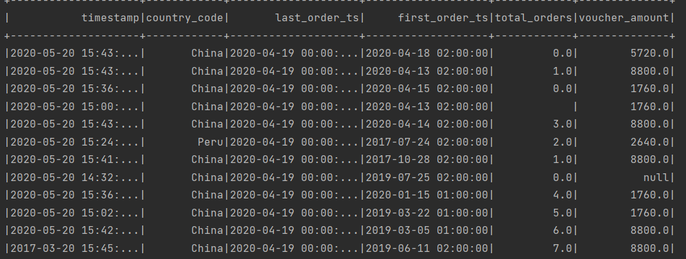
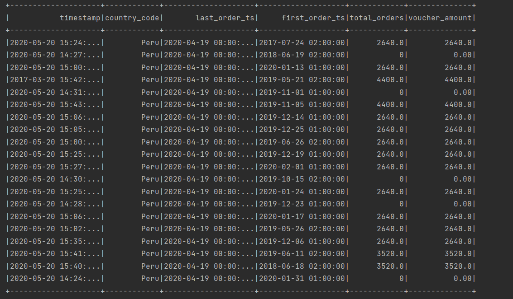
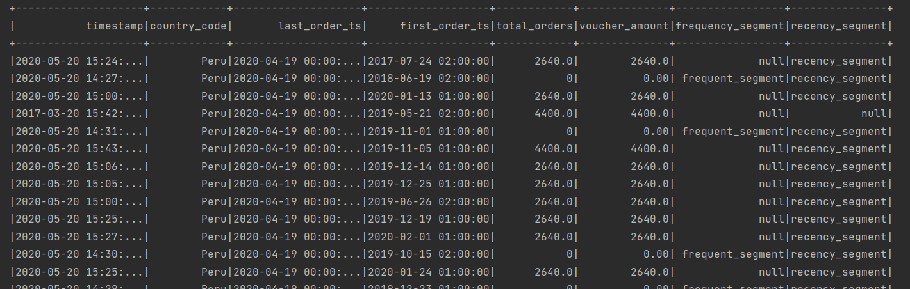
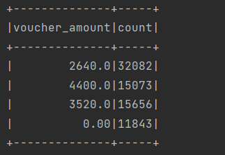
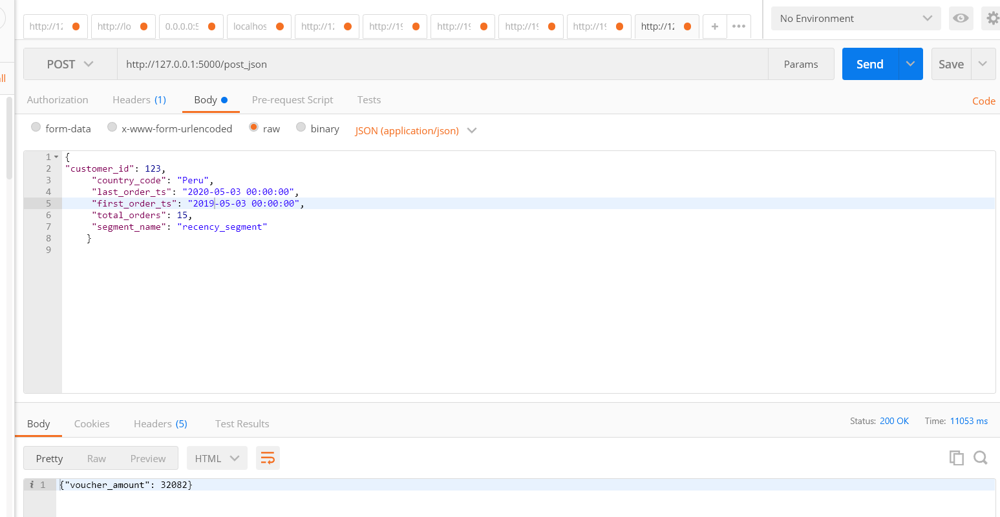

Delivery Hero:

Logic:
Looking at the Dataframe in Parquet:

1. total_orders and voucher_amount had some null values in the field.
So I set the columns with null, ‘’ or “ “ values to 0.00 value.

2. Next, based on the’ total_orders ‘– I set a frequency_segment
and based on ‘timestamp ‘and ‘last_order_ts ´day’s difference – I set the recency_segment.

3. Based on segment passed in API,
and the time range within the which the customer request was send and corresponding dataframe entries for the same time period,

I filter out all voucher amounts.

and send the maximum voucher amount for the segment.

Then a maximum count of the voucher amount was sent back to the Postman.

Assumptions:

I assumed that the dataframe would have 2 types of segments – frequency and regency.

Frequency is based on total number of orders.
 frequent_segment -  
"0-4" - customers which have done 0-4 orders
"5-13" - customers which have done 5-13 orders
"14-37" - customers which have done 14-37 orders    
And recency_segment -  
"30-60" - 30-60 days since the last order
"61-90" - 61-90 days since the last order
"91-120" - 91-120 days since the last order
"121-180" - 121-180 days since the last order
"180+" - more than 180 days since the last order
 
While some total_orders can be more than 37, in that case the ‘frequency_segment ‘was set to null.

And in case the difference between ‘timestamp‘– which I assumed was the date on which the entry was added to the Parquet and ‘last_order_ts ‘column difference would give the’ regency_segment’.
In case the number of days is > 180 or < 30, the regency_segemnt column would be set to null.

After these two columns were set and given that each row in df corresponds to a different customer, we look for the segment value from request API and also find the time period same as given API last and first order ts, so any matching segment which also falls in between the given time period will be stored in the df.

And then grouped different voucher amount 

and out of this found the maximum value to be returned to the API.

I have also assumed unit test cases result. The main idea I was going for testing the API for success and failure (empty payload sent)
There can be multiple test cases added – 
1.	Incomplete payload
2.	Wrong url 
Etc.

Scalable Solutions:
Incase of large files, the parquet files can be stored on AWS S3 or a similar service on GCP.
Since AWS S3 is scalable – the files can be stored partitioned on the basis on year. Partition on basis on year can give a faster way to find that year’s voucher amount.

Also, different buckets can be used for different functionalities.
For the API request coming in, an API Gateway can be set.

Setting Up:
The docker image can eb built by: docker build --tag python-flask .

I ran the main.py by running the main.py
